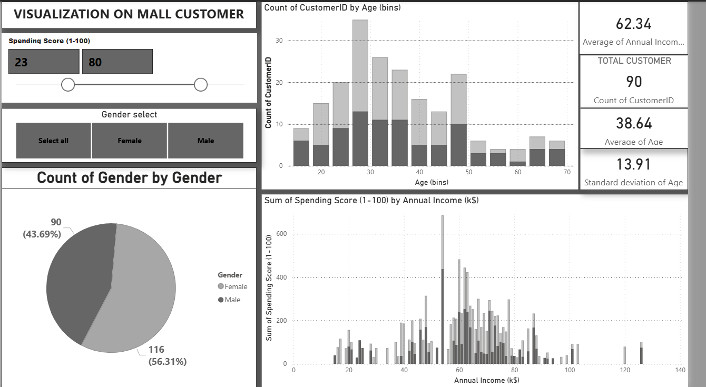

# 🛍️ Mall Customer Analysis & Dashboard

## 📌 Project Overview

This project focuses on analyzing mall customer data to understand spending behavior, income patterns, and age distribution. The goal was to perform Exploratory Data Analysis (EDA) and convert raw data into meaningful business insights using visual analytics.

The project demonstrates the complete data analytics workflow — from data examination to dashboard creation.

---

## 🎯 Objectives

* Examine customer dataset using Python
* Clean and preprocess raw data
* Perform Exploratory Data Analysis (EDA)
* Identify spending patterns and customer trends
* Build an interactive dashboard for visual insights

---

## 🧰 Tools & Technologies Used

* **Python** (Data Analysis)
* **Pandas** (Data Cleaning & Manipulation)
* **NumPy** (Numerical Operations)
* **Power BI** (Interactive Dashboard)
* **VS Code** (Python Development Environment)

---

## 📊 Dataset Features

The dataset includes customer-related attributes such as:

* Customer ID
* Gender
* Age
* Annual Income
* Spending Score

---

## 🔍 Steps Performed

### 1️⃣ Data Examination

* Loaded dataset using Python (Pandas)
* Checked dataset shape, columns, and datatypes
* Verified missing values
* Generated statistical summaries using scripts in VS Code

### 2️⃣ Data Cleaning

* Removed inconsistencies
* Handled formatting issues
* Ensured data types were appropriate for analysis

### 3️⃣ Exploratory Data Analysis

* Analyzed age distribution of customers
* Compared spending score patterns
* Studied income vs spending relationships
* Examined gender-based customer distribution
* Identified customer behavior trends

### 4️⃣ Data Visualization (Dashboard)

Built an interactive Power BI dashboard including:

* Customer count metrics
* Gender distribution (Pie Chart)
* Age distribution (Histogram)
* Income vs Spending analysis
* Dynamic filters for better exploration

---

## 📈 Key Insights

* Identified customer segments based on spending score
* Observed relationship between annual income and spending behavior
* Visualized age groups contributing most to mall revenue
* Compared purchasing patterns across genders

---

## 🖼️ Dashboard Preview



---

## 🚀 Project Outcome

This project helped in understanding:

* Practical implementation of data analysis concepts
* Converting raw data into actionable insights
* Building business-friendly dashboards
* Improving data storytelling using visual tools

---

## 📁 Project Structure

```
Mall-Customer-Analysis
│
├── Dataset
├── Python Analysis Notebook
├── Power BI Dashboard File
└── README.md
```

---

## ▶️ How to Use

1. Open the Python scripts in VS Code to view the analysis
2. Run the scripts to reproduce data examination steps
3. Open the Power BI file to explore the interactive dashboard

---

## 👨‍💻 Author

**Student Data Analytics Project**

---

## ⭐ Learning Highlights

* Strengthened Python data analysis skills
* Learned practical EDA workflow
* Improved dashboard design understanding
* Gained hands-on experience with business data visualization

---

> This is a beginner-friendly data analytics project created for learning and practice purposes.
