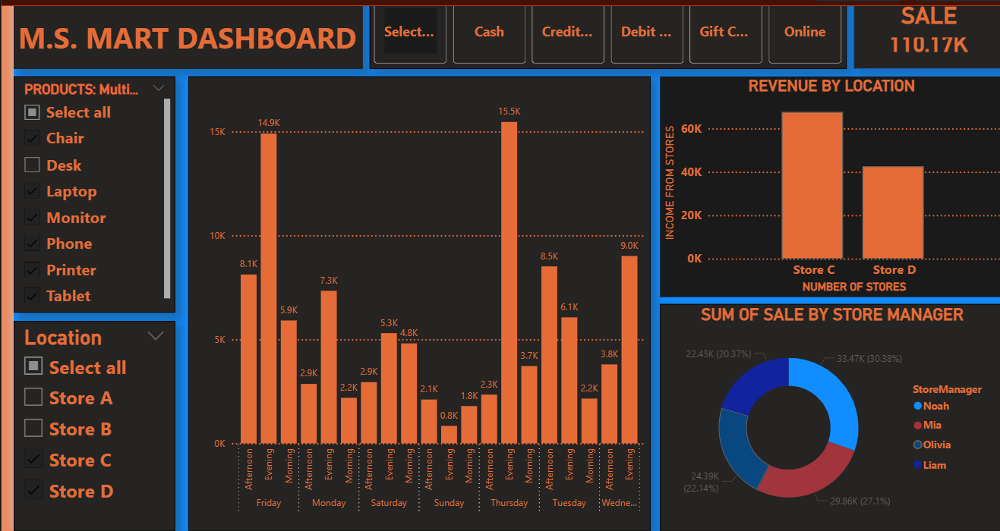

<div align="center">

# 🛒 Retail Store Transaction Dataset Analysis

[](https://www.python.org/)
[](https://pandas.pydata.org/)
[](https://matplotlib.org/)
[](https://powerbi.microsoft.com/)
[](https://jupyter.org/)
[](LICENSE)

<br/>

> 📊 **A complete, multi-tool data analysis project** on retail store transactions — combining Python EDA, interactive Power BI dashboards, a presentation deck, and a full PDF report.

<br/>


</div>

---

## 👨‍💻 About the Author

<div align="center">

| | |
|---|---|
| 🎓 **Name** | Shanib Khan |
| 🔢 **Roll No** | CSC/24/42 |
| 📚 **Subject** | Data Analysis and Visualization |
| 🎯 **Semester** | 4th |

<br/>

[](https://instagram.com/shanib99)
[](https://www.linkedin.com/in/shanib-khan-515a8a316/)
[](mailto:shanibkhan622@gmail.com)

</div>

---

## 📌 Table of Contents

- [📖 Project Overview](#-project-overview)
- [📂 Dataset Description](#-dataset-description)
- [🔧 Tech Stack](#-tech-stack)
- [📊 Analysis Breakdown](#-analysis-breakdown)
- [⚡ Power BI Dashboard](#-power-bi-dashboard)
- [📈 Key Insights](#-key-insights)
- [🗂️ Project Structure](#️-project-structure)
- [🚀 Getting Started](#-getting-started)
- [📸 Outputs](#-outputs)
- [🤝 Connect With Me](#-connect-with-me)

---

## 📖 Project Overview

This project performs an **end-to-end data analysis** on a retail store transaction dataset using **two different tools** — Python for scripted EDA and Power BI for interactive dashboards. The goal is to extract meaningful business insights by analyzing:

- 🏪 **Store performance** across 4 locations
- 📦 **Product revenue** across 7 product categories
- 💳 **Payment method** preferences and trends
- 👨‍💼 **Store manager** effectiveness and cashier-manager groupings
- 🧾 **Cross-dimensional** revenue breakdowns (Location × Product × Manager)
- ⚡ **Interactive Power BI** visuals for deep-dive exploration

The project delivers **5 outputs**: a Jupyter Notebook, a Python script, a Power BI dashboard (`.pbix`), a PowerPoint presentation, and a full PDF report.

---

## 📂 Dataset Description

The dataset contains **199 retail transactions** stored in an Excel file (`Retail-Store-Transactions (1).xlsx`) and also exported as HTML.

| Column | Type | Description |
|--------|------|-------------|
| `time` | String | Time of transaction (HH:MM) |
| `StoreID` | String | Store identifier (S1–S9) |
| `Location` | String | Store location (Store A / B / C / D) |
| `Product` | String | Product sold |
| `Quantity` | Integer | Number of units sold |
| `PaymentType` | String | Payment method used |
| `TransactionID` | String | Unique transaction ID |
| `Cashier` | String | Cashier ID (C1–C5) |
| `StoreManager` | String | Manager name |
| `TimeOfDay` | String | Morning / Afternoon / Evening |
| `DayOfWeek` | String | Day of the week |
| `TotalPrice` | Float | Total transaction value (₹) |
| `per unit` | Float | Price per unit (₹) |

### 📌 Dataset Stats at a Glance

```
Total Transactions  : 199
Stores              : 4  (Store A, B, C, D)
Products            : 7  (Chair, Desk, Laptop, Monitor, Phone, Printer, Tablet)
Store Managers      : 4  (Noah, Olivia, Mia, Liam)
Cashiers            : 5  (C1 – C5)
Payment Types       : 5  (Gift Card, Debit Card, Credit Card, Online, Cash)
Total Revenue       : ₹2,20,200.37
```

---

## 🔧 Tech Stack

<div align="center">

| Tool | Purpose |
|------|---------|
|  | Core programming language |
|  | Data loading, cleaning & analysis |
|  | Charts and visualizations |
|  | Interactive notebook environment |
|  | Interactive business intelligence dashboard |
|  | Source dataset format (.xlsx) |
|  | Exported dataset (HTML format) |

</div>

---

## 📊 Analysis Breakdown

### 1️⃣ Data Loading & Cleaning

```python
import pandas as pd
import matplotlib.pyplot as plt

df = pd.read_excel("Retail-Store-Transactions (1).xlsx")

# Drop empty/unnamed columns
df.drop(columns=["Unnamed: 17"], inplace=True)
df = df.loc[:, ~df.columns.str.contains("^Unnamed")]

print(df.head(4))
```

---

### 2️⃣ Exploratory Analysis — Value Counts

```python
print("Product counts:",       df["Product"].value_counts())
print("Unique products:",      df["Product"].unique())
print("Location counts:",      df["Location"].value_counts())
print("Store Manager counts:", df["StoreManager"].value_counts())
print("Cashier counts:",       df["Cashier"].value_counts())
```

| Category | Top Value | Count |
|----------|-----------|-------|
| Product | Phone | 38 |
| Location | Store C | 64 |
| Store Manager | Noah / Olivia | 53 each |
| Cashier | C1 | 45 |

---

### 3️⃣ Revenue by Location

```python
r_from_d = df[df["Location"] == "Store D"]["TotalPrice"].sum()
r_each_l = df.groupby("Location")["TotalPrice"].sum()

# Bar chart
r_each_l_graph = df.groupby("Location")["TotalPrice"].sum()
r_each_l_graph.plot(kind="bar")
```

| Location | Revenue (₹) | Share |
|----------|-------------|-------|
| 🥇 Store C | 82,529.80 | 37.5% |
| 🥈 Store D | 54,490.08 | 24.7% |
| 🥉 Store B | 46,201.25 | 21.0% |
| Store A | 36,979.24 | 16.8% |

---

### 4️⃣ Revenue by Product

```python
r_each_p = df.groupby("Product")["TotalPrice"].sum()
print("Revenue per product:", r_each_p)
```

| Rank | Product | Revenue (₹) |
|------|---------|-------------|
| 🥇 1 | Phone | 39,972.89 |
| 🥈 2 | Desk | 39,519.04 |
| 🥉 3 | Monitor | 39,149.59 |
| 4 | Printer | 37,266.78 |
| 5 | Laptop | 34,613.89 |
| 6 | Chair | 15,524.54 |
| 7 | Tablet | 14,153.64 |

---

### 5️⃣ Revenue — Location × Product

```python
revenue = df.groupby(["Location", "Product"])["TotalPrice"].sum()
print("Revenue from each location with every product:", revenue)
```

| Location | Chair | Desk | Laptop | Monitor | Phone | Printer | Tablet |
|----------|-------|------|--------|---------|-------|---------|--------|
| Store A | 2,858 | 8,818 | 2,583 | 7,547 | 7,011 | 4,772 | 3,391 |
| Store B | 2,747 | 3,854 | 8,416 | **14,162** | 8,600 | 8,386 | 36 |
| Store C | 4,272 | 14,914 | **18,784** | 12,182 | 15,129 | 11,274 | 5,975 |
| Store D | 5,647 | 11,933 | 4,832 | 5,259 | 9,233 | 12,835 | 4,752 |

---

### 6️⃣ Payment Type Analysis

```python
print("PAYMENT METHOD:", df["PaymentType"].unique())
print("Count of payment method:", df["PaymentType"].value_counts())

loc_pay = df.groupby(["Location","PaymentType"])["TotalPrice"].sum()
loc_pay_cnt = df.groupby(["Location","PaymentType"]).size().unstack()
loc_pay_cnt.plot(kind="bar")
plt.ylabel("Count of Payment Type")
plt.title("Payment Type Count per Store")
plt.show()
```

| Payment Type | Count | Share |
|-------------|-------|-------|
| 💳 Gift Card | 49 | 24.6% |
| 💳 Debit Card | 43 | 21.6% |
| 💳 Credit Card | 43 | 21.6% |
| 🌐 Online | 35 | 17.6% |
| 💵 Cash | 29 | 14.6% |

---

### 7️⃣ Store Manager Analysis

```python
storemanager_names = df["StoreManager"].unique()
print("NUMBER OF STORE MANAGERS:", len(storemanager_names))

val_of_each = df["StoreManager"].value_counts()
grp_cashier_mgr = df.groupby(["Cashier","StoreManager"]).size()

# Bar chart: cashier vs manager
grp_cashier_mgr.unstack().plot(kind="bar")
plt.title("Cashier group with manager")
plt.show()
```

| Manager | Transactions | Total Revenue (₹) | Avg Sale (₹) |
|---------|-------------|-------------------|-------------|
| Noah | 53 | 59,356.69 | 1,119.94 |
| Olivia | 53 | 53,574.86 | 1,010.85 |
| Mia | 47 | 55,876.13 | **1,188.85** |
| Liam | 46 | 51,392.69 | 1,117.23 |

---

### 8️⃣ Summary Statistics & Pivot Table

```python
summary = df.groupby("StoreManager").agg(
    Total_Sales=("TotalPrice", "sum"),
    Avg_Sale=("TotalPrice", "mean"),
    Number_of_Transactions=("TotalPrice", "count")
)

pivot = df.pivot_table(
    index="StoreManager",
    columns="Product",
    values="TotalPrice",
    aggfunc="sum",
    margins=True,
    margins_name="Total_All_Products"
)
print(summary)
print(pivot)
```

---

## ⚡ Power BI Dashboard

> 🎯 **An interactive Power BI report** (`deep_insight_retail_transaction.pbix`) was built alongside the Python analysis to provide a dynamic, filterable dashboard experience.

### 📸 Dashboard Screenshots

> 💡 **How to add your screenshots:**
> 1. Open `deep_insight_retail_transaction.pbix` in Power BI Desktop
> 2. Take screenshots of each page (press `Win + Shift + S` on Windows)
> 3. Save them in a `screenshots/` folder inside the repo
> 4. Replace the placeholders below with your actual image paths

<br/>

#### 🖥️ Page 1 — Overview Dashboard
<!-- Once you add the screenshot, replace the block below with: -->
<!--  -->

```
## 🖥️ Page 1 — Overview Dashboard



<br/>


<br/>

### 🔗 Power BI Features Built

| Feature | Description |
|---------|-------------|
| 📊 **KPI Cards** | Total revenue, transaction count, avg sale per store |
| 📉 **Bar Charts** | Product and location revenue comparisons |
| 🥧 **Pie / Donut Charts** | Payment type distribution and manager share |
| 🔽 **Slicers** | Filter by Location, Manager, Product, Payment Type |
| 📅 **Time Analysis** | Transactions by TimeOfDay and DayOfWeek |
| 🗃️ **Matrix Table** | Manager × Product revenue pivot |

---

## 📈 Key Insights

> 🏆 **Top Findings from the Analysis**

```
🏪  Store C           →  Highest revenue (₹82,530) — 37.5% of total sales
📦  Phone             →  Top revenue product (₹39,973)
💳  Gift Card         →  Most popular payment method (49 transactions)
👨‍💼  Noah / Olivia    →  Most transactions (53 each)
📊  Mia               →  Highest average sale per transaction (₹1,188)
🔗  Store C + Laptop  →  Best product-location combo (₹18,784)
🏦  Store B + Monitor →  Single highest product-location value (₹14,162)
💰  Total Revenue     →  ₹2,20,200.37 across 199 transactions
```

---

## 🗂️ Project Structure

```
📁 retail_store_analysis/
│
├── 📓 notebook.ipynb                              # Jupyter Notebook — Python EDA + charts
├── 🐍 retail_store.py                             # Standalone Python analysis script
├── ⚡ deep_insight_retail_transaction.pbix        # Power BI interactive dashboard
├── 🖥️ Retail_Store_Analysis_Shanib.pptx          # PowerPoint presentation (10 slides)
├── 📄 Retail_Store_Analysis_Report_Shanib.pdf     # Full PDF report (10 sections)
├── 📋 README.md                                   # This file
│
├── 📁 data/
│   ├── 📗 Retail-Store-Transactions (1).xlsx      # Source dataset (Excel)
│   └── 🌐 Retail-Store-Transactions (1).html      # Dataset exported as HTML
│
└── 📁 screenshots/                                # Power BI dashboard screenshots
    ├── powerbi_overview.png                       # ← add your screenshots here
    ├── powerbi_products.png
    └── powerbi_stores.png
```

---

## 🚀 Getting Started

### ✅ Prerequisites

```bash
pip install pandas matplotlib openpyxl jupyter
```

### 🖥️ Run the Jupyter Notebook

```bash
# Clone the repository
git clone https://github.com/shanib99/retail-store-analysis.git

# Navigate into the project
cd retail-store-analysis

# Launch Jupyter Notebook
jupyter notebook notebook.ipynb
```

### 🐍 Run the Python Script

```bash
python retail_store.py
```

### ⚡ Open Power BI Dashboard

```
1. Download Power BI Desktop (free) → https://powerbi.microsoft.com/
2. Open: deep_insight_retail_transaction.pbix
3. Explore interactive dashboards with filters and slicers
```

---

## 📸 Outputs

| Output | File | Description |
|--------|------|-------------|
| 📓 **Jupyter Notebook** | `notebook.ipynb` | All Python analysis + charts |
| 🐍 **Python Script** | `retail_store.py` | Standalone runnable script |
| ⚡ **Power BI Dashboard** | `deep_insight_retail_transaction.pbix` | Interactive BI report |
| 🖥️ **PPT Presentation** | `Retail_Store_Analysis_Shanib.pptx` | 10-slide dark-themed deck |
| 📄 **PDF Report** | `Retail_Store_Analysis_Report_Shanib.pdf` | Full 10-section report |

### 📊 Visualizations Generated

| Chart Type | Tool | What it Shows |
|------------|------|---------------|
| 📊 Bar Chart | Python + Power BI | Revenue by location & product |
| 📊 Grouped Bar | Python + Power BI | Payment types per store |
| 🥧 Pie Chart | Python + Power BI | Manager sales share |
| 📉 Pivot Matrix | Python + Power BI | Manager × Product breakdown |
| 🔽 Slicers | Power BI only | Dynamic filtering across all dimensions |

---

## 🤝 Connect With Me

<div align="center">

If you found this project helpful, feel free to ⭐ **star the repo** and connect!

<br/>

[](https://instagram.com/shanib99)
[](https://www.linkedin.com/in/shanib-khan-515a8a316/)
[](mailto:shanibkhan622@gmail.com)

<br/>

---


*Made with ❤️ by Shanib Khan*

</div>

